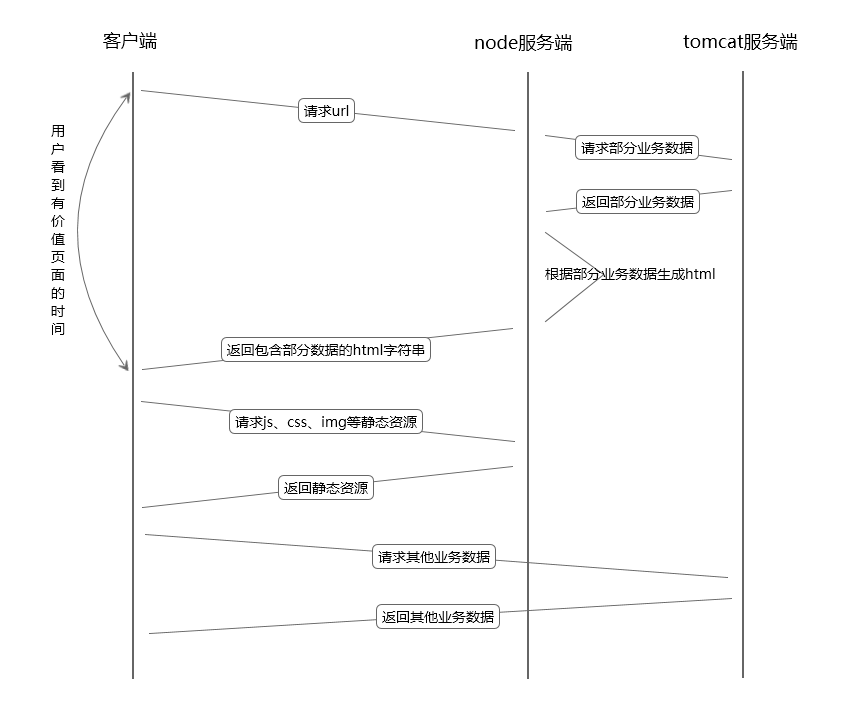

为什么要做SSR（server-side-render，服务端渲染）？

优势：
> * 提高页面加载速度
> * SEO优化（咱公司不需要😥）

劣势：
> * 异步加载
> * 各种炫酷交互
> * 减轻服务器压力

咋一看，好像是弊大于利。先来说一下优势：

一般来说，真实上线环境中我们的前端nginx服务和java后端tomcat服务是放在一台机器上的。此时，若抛弃nginx服务，采用node端服务，毫无疑问node服务向tamcat发起的http请求会比客户端向tamcat发起的http请求要快（因为node服务于tamcat服务在一台机器上，省去了在链路中的传输时间）。而且客户端在发送http请求之前还要下载对应的js，这也是一次对于nginx的http请求，这就更加推迟了用户看到页面出现在眼前的时间。
还有一点要吐槽的是，nginx一大特色在于他的负载均衡，而这一点我们公司完全没有用到，也不需要用到，只是简单的使用了他的反向代理。
所以，合理使用SSR，是可以提高页面加载速度的。至于怎么合理使用，下面会介绍。

现在来逐条分析一下劣势：

关于异步加载，可以说是服务端渲染的一个弊端，但是也不是不可以解决，因为使用SSR并不代表不能实现异步加载，关键是掌握一个度。
现有开发模式下，可以说是全盘异步加载，初始html是不包含任何有用数据的，所有的数据都是通过页面下载完js后，执行js代码，然后ajax发送http请求到tomcat返回数据之后渲染模板操作dom再展示在页面上。

这样子真的好么？

用户等到有用信息的时间其实可以进一步压缩。关于具体页面，一方面需要评估对于此页面用户想要看到什么信息，另一方面也需要评估哪些信息查询起来效率高、耗时短，哪些信息查询起来效率底、耗时长。综合两方面的因素可以确定出SSR的范围，范围之外的内容可以继续放在页面加载的js中进行ajax异步加载。采用这种方式，想象一下，是不是可以提高用户体验呢😤。

然后是炫酷交互，无非就是js玩出的花样，使用SSR并不代表完全放弃CSR（client-side-render，客户端渲染），两种方式结合完全可以实现CSR所能实现的任何东西。

最后一条减轻服务器压力，这确实是一个无法解决的问题，但是就咱公司的用户量，会有这个问题么？🙈

下图展示了公司目前框架流程图和使用SSR与CSR结合的流程图

公司目前框架流程图

SSR+CSR流程图

利弊分析完了，下面就来实践吧。 

首先，还是来介绍下公司前端技术栈：

> * gulp自动化构建工具
> * html、css、javascript
> * jQuery

没了。。。就这么多😂

（由于跑了Performance，故所有时间都比实际时间要长）

无缓存：
`CSR-jQuery > SSR-jsdom-jQuery > SSR-express-jade > SSR-koa-doT > SSR-express-ejs ≈ SSR-koa-ejs`

有服务器缓存+浏览器缓存：
`CSR-jQuery > SSR-jsdom-jQuery > SSR-express-jade ≈ SSR-koa-doT > SSR-express-ejs ≈ SSR-koa-ejs`

仅有服务器缓存：
`CSR-jQuery > SSR-jsdom-jQuery > SSR-express-jade > SSR-koa-doT > SSR-express-ejs ≈ SSR-koa-ejs`

测试环境中，客户端、nginx服务端、node服务端、模拟tomcat的node服务都在一台服务器，弱化了node服务与tamcat服务通信速度比客户端与tomcat服务快的优势。即使在这种条件下，也能明显看出SSR相比于CSR在用户体验方面的优势。

与公司架构结合的问题：