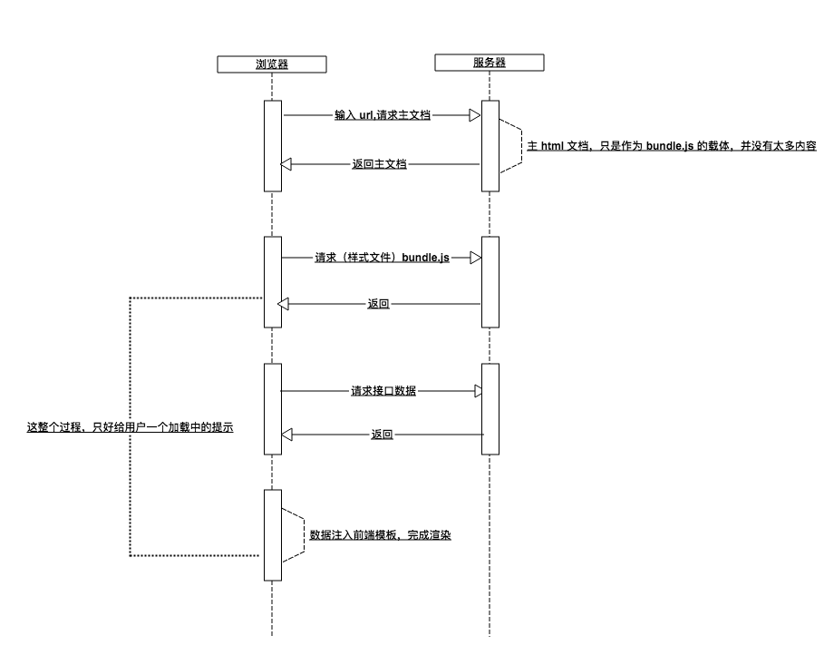
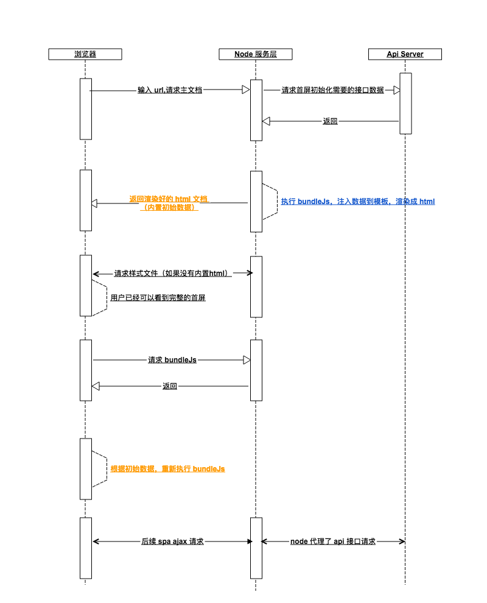

# 服务端渲染vs客户端渲染到前后端同构

关于服务端渲染与客户端渲染的优劣，互联网上已经有过很多的文章进行过分析，在这里我谈一下我个人的见解。

首先，还是来老生常谈一下关于两种渲染方式的主要优劣：

服务端渲染（仅列出当下最突出的优劣）：

>  优：
>  * SEO友好（目前现状下，我认为是最大的优点，也是最大的需求）
>  * 首屏渲染速度快（不用下载臃肿的bundle.js）
>
>  劣：
>  * 增加服务器压力（在访问量猛增时，这是非常致命的，可能直接导致服务器挂掉）
>  * 交互方式单一，无法进行异步刷新（可以通过后端在html中插入js代码绑定事件来实现异步刷新）

客户端渲染的优劣则与服务端渲染相反。

在十几年前，那时候`javascript`还没有兴起，web开发还是使用传统的`ASP`、`Java`、`PHP`等语言，渲染方式也就局限于服务端渲染。但是随着`jQuery`的发展，异步加载技术的成熟，前端所做的事情也就越来越多。随着一批批前端开发人员对于交互体验的不断完善，页面性能的极致追求，在近几年不断涌现出非常优秀的前端框架库，比如说当下最流行的`Angular`、`React`、`Vue`和处于成长阶段的`next.js`、阿里的`beidou`框架等。可以说，如今js真可谓是百家争鸣了。

从一开始后端语言驱动的服务端渲染，到如今`React`等前端框架引领的客户端渲染，不管是用户体验方面，还是性能方面，都有了一个质的提升。当我们正享受着客户端渲染带来的舒适时，一部分互联网企业又悄悄的变回了服务端渲染，这样一个逆着发展方向的做法，实属无奈的选择，很大一方面是为了应对国内某度尴尬的SEO。为了针对服务端渲染的需求，`React`还实现了`renderToString`的方法用来将根据数据生成的dom结构转成相应字符串，方便由后端输出给前端。至于`Vue`和`Angular`有没有实现类似的方法还没有去了解过，用兴趣的同学可以去他们的官网查下文档。

据我所知，Google已经实现了可以通过执行页面中js代码的方式来爬取数据，也就是说，Google已经有能力爬取客户端渲染的页面了（不是崇洋媚外，确实人家做的比国内好），而国内某度，还停留在爬取html的阶段。单纯的客户端渲染，html文件是没有实质性内容的，所有内容都是通过js异步加载来的，于是某度面对客户端渲染的页面，只能两眼一黑。

不过，国内搜索引擎终究也会实现对客户端渲染页面的爬取的，这只是一个时间问题罢了。虽然说在当下，服务端渲染这个最大的优点还是客户端渲染无法解决的，但是随着时间的推移，互联网的进步，这都将不再是问题。

再来说说首屏渲染的问题。用过`React`或者`Vue`的同学都知道，打包出来的`bundle.js`文件大小通常都在1M以上，而这个入口js通常要在渲染首页之前完全下载完毕，然后再运行其中的js获取数据、渲染页面，这是spa页面加载的一个机制。js的运行、数据的获取、页面的渲染这些都是浏览器的工作，基于现在的V8引擎，这些步骤都可以很快完成，而这个1M以上甚至更大的入口js的下载就是一个非常大的问题了。如果是pc端，在目前国内正常用户的网络环境下，这点大小的文件还不成问题，但如果是移动端，就要好好考虑一下了。在4G网络环境下，这1M的文件可以说下载起来非常轻松，1秒就可以下载完毕；如果使用3G网络，则1M大概需要下载4到5秒，这个时间已经影响到用户体验了；如果使用2G网络，或者在信号不好的地方，那这个时间就惨不忍睹了，用户需要等待漫长的白屏，甚至会造成当前页面已经打不开了的误解。

> 客户端渲染流程

针对这种网络状况不好的情况下，首屏渲染极慢的问题，有人提出了**同构**的思想。其意为前后端使用同一套代码，首屏使用服务端渲染，将渲染好的html直接交给浏览器去渲染，浏览器渲染出首屏之后继续下载`bundle.js`，运行js，并且重新渲染页面。由于渲染好的html流相较于`bundle.js`来说，体积小了很多，所以采用同构方式的web页面，一定程度上解决了首屏渲染慢的问题，而且合理利用缓存策略还可以一定程度减轻服务器压力。当然这种模式当中还存在着其他问题，在这里就不细说了。

> 同构渲染流程

使用**同构**这种开发模式，虽然不能完全解决SEO的问题，但是首屏是可以被爬取的，如果说项目不是类似于淘宝这种内容型网站（网站内部各个页面都有SEO需求），那么这种模式就非常优秀了，解决了纯客户端渲染在当下面临的两个最大的问题。

在今年举办的第12届D2前端大会上，笔者又听到了一个十分优秀的想法，并且阿里已经将之实现并申请了专利————**智能降级**策略。具体名字是不是这个已经记不太清了，大致内容是在**同构**的基础之上，优先使用服务端渲染，当访问量激增导致服务器负载超过设置的阈值之后，智能将部分渲染任务交给客户端处理，使服务器承受压力降低（想想就很厉害啊，毕竟阿里，有钱有人有才）。

毫无疑问，**同构**或者**智能降级**在面对当前国内互联网发展状况下，是非常有发展空间的。但是如果需要考虑到开发成本和硬件成本，单纯的客户端渲染还是占有优势的。**同构**或许是web开发的一个方向，但是绝不仅仅是唯一的一条路，具体采用什么样的方式构建项目，还是需要根据具体项目的需求来确定。

把视角转移到我们公司的项目，由于产品是安装在**GAW**中，对SEO完全没有需求，而且产品更多的是pc端的web应用，**GAW**内的网络环境还是很好的，首屏渲染问题也可以不去考虑，如果想要寻求技术的进步，纯客户端渲染无疑是一个非常好的选择。

WAY平台最初是想要做出一个spa项目的公共架构，若是使用React或者Vue进行重构，必定会使公司项目质量上升数个台阶。当然，目前还存在着各种问题阻碍着技术的进步，但是这绝对是一个值得认真思考的方向。