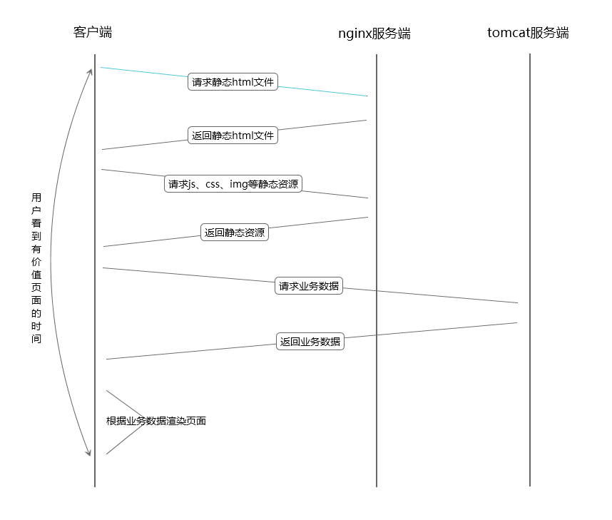

什么是SSR？

SSR，全称server-side-render，即服务端渲染，实现起来就是在服务端将数据拼入html字符串中，传给浏览器，浏览器直接渲染。传统的jsp开发模式便是这种。
与之对应的就是CSR，client-side-render，即客户端渲染，前端拿到的html只是一个框架，所有数据通过浏览器解析运行JavaScript脚本，利用ajax拿到数据，再生成dom插入到document中。公司目前的前后端分离开发模式便是这种。

那你一定会问，既然CSR是从SSR进化而来的，为什么要退回去做SSR？

其实，本文要说的SSR，和传统的SSR有点不一样，本文所说的是在node端进行SSR。

为什么要做SSR？

下图是vue的回答

优势：
> * 提高页面加载速度
> * SEO优化（咱公司不需要😥）

劣势：
> * 异步加载
> * 各种炫酷交互
> * 服务器压力

咋一看，好像是弊大于利。先来说一下优势：

一般来说，真实上线环境中我们的前端nginx服务和java后端tomcat服务是放在一台机器上的。此时，若抛弃nginx服务，采用node端服务，毫无疑问node服务向tamcat发起的http请求会比客户端向tamcat发起的http请求要快（因为node服务于tamcat服务在一台机器上，省去了在链路中的传输时间）。而且客户端在发送http请求之前还要下载对应的js，这也是一次对于nginx的http请求，这就更加推迟了用户看到页面出现在眼前的时间。
还有一点要吐槽的是，nginx一大特色在于他的负载均衡，而这一点我们公司完全没有用到，也不需要用到，只是简单的使用了他的反向代理。
所以，合理使用SSR，是可以提高页面加载速度的。至于怎么合理使用，下面会介绍。

现在来逐条分析一下劣势：

关于异步加载，可以说是服务端渲染的一个弊端，但是也不是不可以解决，因为使用SSR并不代表不能实现异步加载，关键是掌握一个度。
现有开发模式下，可以说是全盘异步加载，初始html是不包含任何有用数据的，所有的数据都是通过页面下载完js后，执行js代码，然后ajax发送http请求到tomcat返回数据之后渲染模板操作dom再展示在页面上。

这样子真的好么？

用户等到有用信息的时间其实可以进一步压缩。关于具体页面，一方面需要评估对于此页面用户想要看到什么信息，另一方面也需要评估哪些信息查询起来效率高、耗时短，哪些信息查询起来效率底、耗时长。综合两方面的因素可以确定出SSR的范围，范围之外的内容可以继续放在页面加载的js中进行ajax异步加载。采用这种方式，想象一下，是不是可以提高用户体验呢😤。

然后是炫酷交互，无非就是js玩出的花样，使用SSR并不代表完全放弃CSR，两种方式结合完全可以实现CSR所能实现的任何东西。

最后一条减轻服务器压力，这确实是一个无法解决的问题，但是就咱公司的用户量，会有这个问题么？🙈

下图展示了公司目前框架流程图和使用SSR与CSR结合的流程图

公司目前框架流程图

SSR+CSR流程图

利弊分析完了，下面就来实践吧。 

首先，还是来介绍下公司前端技术栈：

> * gulp自动化构建工具
> * html、css、javascript
> * jQuery

先写一个node-server模拟tomcat服务

    // Require the framework and instantiate it
    const fastify = require('fastify')()

    const opts = {
      schema: {
        response: {
          200: {
            type: 'array',
            items: {
              type: 'object',
              properties: {
                id: {
                  type: 'number'
                },
                title: {
                  type: 'string'
                }
              }
            }
          }
        }
      }
    }

    // Declare a route
    fastify.get('/', function (request, reply) {
      reply.send('hello')
    })

    // Declare a route
    fastify.get('/api/test', opts, async function (request, reply) {
      const pro = new Promise((reslove, reject) => {
        const data = []
        for (let i = 1; i <= 10000; i++) {
          data.push({
            id: i,
            title: `test${i}`
          })
        }
        setTimeout(() => {
          reslove(data)
        }, 20)
      })

      return await pro
    })

    // Run the server!
    fastify.listen(4000, function (err) {
      if (err) {
        fastify.log.error(err)
        process.exit(1)
      }
    })

使用fastify，模拟了10000条数据，并经过20毫秒响应。

然后再基于公司目前框架写一个demo

index.html

    <html>

    <head>
      <meta charset="utf-8">
      <title>Untitled</title>
      <meta name="viewport" content="initial-scale=1, maximum-scale=1">
      <link rel="stylesheet" href="./style.css"" />
    </head>

    <body>

      

      
      
    </body>

    </html>

index.js

    (function($) {
      $.get('/api/test').then(function(res) {
        var str = '<ul>'
        res.forEach(function(data) {
          str += '<li id="' + data.id + '">' + data.title + '</li>'
        })
        str += '</ul>'
        $('#root').html(str)
      })
    })(jQuery)

前端生成html，插入dom中，现在来看下采用这种方案，在不同缓存情况下time-to-content的时间。

无缓存

有服务器缓存+浏览器缓存

仅有服务器缓存

可以看到，无缓存情况下，time-to-content约为2200ms，有服务器缓存+浏览器情况下，约为1500ms，仅有服务器缓存情况下，约为2000ms。

然后，再来尝试下SSR。先基于现有技术栈，在node端使用jQuery操作html。

    const fs = require('fs')
    const { JSDOM } = require('jsdom')
    const jquery = require('jquery')
    const axios = require('axios')
    const tpl = require('../template/demo1')

    const html = fs.readFileSync(process.cwd() + '/views/demo1.html', 'utf8')

    const render = async () => {
      const dom = new JSDOM(html)
      const { window } = dom
      const $ = jquery(window)
      const { data } = await axios.get('http://localhost:4000/api/test') // $.ajax存在跨域问题
      const str = tpl(data)
      $('#root').html(str)
      const res = dom.serialize()
      return res
    }

    module.exports = render

在不同缓存情况下，性能如下

无缓存

有服务器缓存+浏览器缓存

仅有服务器缓存

可以看到，在不同情况下，相比于CSR大约有了20%-30%的提升。其实这是在有10000个dom节点下的数据，如果输出每行代码的执行时间会发现，同样的一行代码

    $('#root').html(str)

在node端运行所需要的时间要远大于在浏览器下需要的时间，这是因为node端的jQuery实际操作的是jsdom虚拟出来的dom节点，这中间的计算量要比在浏览器中大很多，于是时间都浪费在了

    $('#root').html(str)
    const res = dom.serialize()

这两行代码上，所以如果在dom节点数较少的情况下，性能提升的会更明显。

但是这就够了么？明显不够。在node端用jQuery实在太耗性能了，而且node端还有着各色各样的模板引擎，完全可以拿来用啊。

在这里我就拿了三种模板引擎做了对比，分别是jade，doT和ejs。jade是express服务器默认使用的模板引擎，doT则宣称自己是最快的，而ejs是一个开发者们广泛使用的一种。

下面就来展示下不同模板引擎的效率，请求的还是我们的模拟服务器，渲染的还是同等数量的dom。

首先是jade

无缓存

有服务器缓存+浏览器缓存

仅有服务器缓存

然后是doT

无缓存

有服务器缓存+浏览器缓存

仅有服务器缓存

最后是ejs

无缓存

有服务器缓存+浏览器缓存

仅有服务器缓存

（由于跑了Performance，故所有时间都比实际时间要长）

可以看到，ejs相比于CSR架构，time-to-content已经提升了大约75%，这已经是一个非常大的提升了。

不过奇怪的是，doT号称是最快的，但是却输给了ejs，这是为什么呢？

如果我们看下network会发现，doT传递给浏览器的html字符串大小比ejs要小很多，这是因为doT发送的是经过压缩的html，不包含各种换行。但是你肯定又会问，既然doT发送的内容要更小，那接收的也就更快，相应的渲染出页面的时间也应该更早啊？这就要看浏览器解析html字符串的机制了，个人猜测，这种压缩之后的html字符串不利于浏览器解析，导致了解析时间的延长，长到能够抵消体积小带来的优势，甚至更甚。（纯属个人猜测，没有深入研究）

经过上面的分析，可以得出各开发模式下的效率排序

无缓存：
`CSR-jQuery > SSR-jsdom-jQuery > SSR-express-jade > SSR-koa-doT > SSR-express-ejs ≈ SSR-koa-ejs`

有服务器缓存+浏览器缓存：
`CSR-jQuery > SSR-jsdom-jQuery > SSR-express-jade ≈ SSR-koa-doT > SSR-express-ejs ≈ SSR-koa-ejs`

仅有服务器缓存：
`CSR-jQuery > SSR-jsdom-jQuery > SSR-express-jade > SSR-koa-doT > SSR-express-ejs ≈ SSR-koa-ejs`

还有一点需要注意的是，测试环境中，客户端、nginx服务端、node服务端和模拟tomcat的node服务都在一台机器上，弱化了node服务与tamcat服务通信速度比客户端与tomcat服务快的优势。即使在这种条件下，也能明显看出SSR相比于CSR在用户体验方面的优势。

但是SSR想要在公司内实际生产中使用，还有各种各样的问题，就比如说：

> 1. 与公司架构结合的问题
> 2. 基础接口效率低下问题
> 3. 等等。。。
